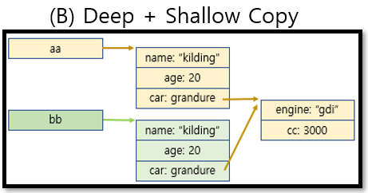
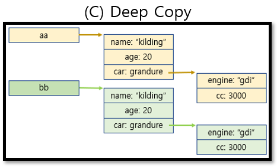

# JavaScript

## 함수
> 함수 선언 방식<br>
> 함수 표현식<br>
> 화살표 함수

```
// 함수 선언식
function sayHi() {
    console.log("hi");
}

// 함수 표현식
const sayHi = function() {
    console.log("hi");
}

// 화살표 함수
const sayHi = () => {
    console.log("hi");
}
```

- <a href="#scope">scope란?</a><br>
- <a href="#property">property란?</a><br>
- <a href="#scope">객체란?</a>

<br><hr>

<h2 id="scope">Scope란</h2>

- 스코프는 참조 대상 식별자를 찾아내기 위한 규칙이다. (쉽게 말해 변수가 어디를 참조해서 값을 가져오는지)

### 스코프의 종류
> 전역 스코프 : 코드 어디에서든지 참조 가능<br>
> 지역 스코프 : 함수 단위로 자신과 하위 함수에서만 참조할 수 있다
- 쉽게 전역 변수와 지역 변수의 개념으로 받아 들이면 편함
- 자바스크립트는 타 언어의 `블록 레벨 스코프`가 아닌 `함수 레벨 스코프`를 참조한다 (let, const 는 `블록 레벨 스코프`)

```
var num = 1;
function number(){
    var num = 2;
    console.log(num);
}
number();
console.log(num);
```

- 변수 num 이 중복 선언
- num을 참조할 때, 함수 number() 내부에서 중복이 된 두 개의 변수 중 어느걸 참조했는지 생각하는게 핵심

- 다음 코드의 결과값을 예상해보자
```
var num = 1;

function one() {
    var num = 10;
    two();
}

function two() {
    console.log(num);
}

one();
two();
```

- js에서는 호출된 기준이 아닌 선언이 된 기준으로 판단하기 때문에 two()가 선언되었을때의 num의 값이 1이다.

<br><hr>

<h2 id="property">프로퍼티란?</h2>

- 기본적으로 `property`란 어떤 값을 나타낸다. 이 때 이 값은 다른 값과 연관되어 있을때 `property`라고 지칭한다.

- 예를들어 문자열에는 length 라는 프로퍼티가 포함되어 있는데, 이 프로퍼티는 문자열 안에 있는 문자의 길이를 정수로 나타낸 값을 담고 있다.

```
const str = "hello";
console.log(str.length);
```

- `property`는 이름과 값을 가지고, 개체 참조를 가질 수 있으며, 함수도 담을 수 있다.

<br><hr>

## 객체

- 문자열, 숫자, bool 등등 객체를 제외한 다른 자료형에는 오직 한 가지 데이터만 담을 수 있어 `원시형(primitive type)`이라고 부른다.
- 객체는 원시형과 달리 다양한 데이터를 담을 수 있다.
- 객체는 `프로퍼티`로 이루어져있고, 프로퍼티는 `key : value`값으로 나와있다.

```
// 객체 생성 방법

let user = {
    name : "kim",
    age : 30
}

// 사용
console.log(user.name);
```
- 또한 객체를 수정 및 추가할 수 있다.
```
user.name = "lee";
user.weight = 50;
```
- 상수(const)로 객체를 만들어도 객체 수정이 가능하다.(왜?)

<br>

## 객체의 key를 확인하고 가져오는 함수 in, for...in

- 객체 안의 프로퍼티 중 key 값이 존재하는지 하지 않는지 파악 하기 위해 in 이라는 함수를 사용한다.

```
let english = {
    a: "hi a",
    b: "hi b",
    c: "hi c"
}
console.log("a" in english)
```

- 객체의 모든 프로퍼티의 key값을 순회하는 것도 가능하다.
```
let user = {
    name : "kim",
    age : 20,
    gender : "male"
}

for(let info in user) {
    console.log(info);
    console.log(user[info]);
}
```
- 객체의 프로퍼티는 다른 객체에 대한 참조 값일 수도 있다. -> 중첩 객체
```
let user = {
    name : "kim",
    body : {
        height : 180,
        weight : 70
    }
}
console.log(user.body.height);
```

<br>

## 참조에 의한 객체 복사
- 객체는 reference가 저장되고 복사된다.
- 객체가 그대로 저장되는 것이 아니라, 객체가 저장되어 있는 `메모리 주소`인 객체에 대한 `참조 값`이 저장된다.
- 예시 2번코드는 얼핏보면 같다고 생각할 수 있지만 객체를 변수에 할당해줄 때는 객체의 주소가 할당되는 것이기 때문에 다르다.
```
//1번
let a = {};
let b = a;
console.log(a === b);

//2번
let a = {};
let b = {};
console.log(a === b);
```

- 이런식으로 복사된 객체는 독립적이지 않고 복사된 객체를 수정하면 참조값을 수정하는 것이기 때문에 기존 객체가 수정이 된다.
```
let user1 = {
    name : "kim"
}
let user2 = user1;
user2.name = "kwon";
console.log(user2.name);
console.log(user1.name);
```

- 기존 객체의 형태를 똑같이 복사하지만 영향을 미치지 않는 독립적인 객체를 만들고 싶다면 어떻게 해야할까?
- 새로운 객체를 만들고 기존 객체의 프로퍼티들을 순회하여 원시수준까지 프로퍼티 복사를 해주면 된다.

```
let user1 = {
    name : "kim",
    age : 26,
}
let user2 = {};

for (let key in user1){
    user2[key] = user1[key];
}

user2.name = "kwon";

console.log(user1.name);
console.log(user2.name);
```

- `spread` 문법을 통해서 쉽게 복사가 가능하다.
```
let user1 = {
    name : "kim",
    age : 26,
}
let user2 = {...user1};

user2.name = "kwon";

console.log(user1.name);
console.log(user2.name);
```

<br>

## Shallow, Deep+Shallow, Deep Copy

```
let user = {
    name : "kim",
    body : {
        height : 180,
        weight : 70
    }
}

user2 = {...user};
user2.name = "kwon";
user2.body.height = 170;
user2.body.weight = 64;

console.log(user.name);
console.log(user.body.height);
console.log(user.body.weight);
```

- `spread` 문법으로 객체 복사를 했기 때문에 `user.name`과 `user2.name`이 서로 영향이 미치지 않는다.
- 왜 `user.body.height` 와 `user2.body.height`는 같게 나오는 걸까?

- 이유는 `spread`문법이 `Deep + Shallow Copy`를 했기 때문이다.

> Shallow Copy

- 기존 객체의 주소값을 참조한다.

<div style="text-align : center"></div>

<br>

> Deep + Shallow Copy

- 새로운 주소의 객체를 만들어 기존객체의 프로퍼티와 원시형까지 복사가 되었지만 다른 주소의 객체를 참조하는 프로퍼티는 주소값을 복사한 상태

<div style="text-align : center"></div>

<br>

> Deep Copy

- 객체내의 객체까지 주소 복사가 아닌 내부 객체의 구조까지 새로 생성하여 복사한다.

<div style="text-align : center"></div>

<br><hr>

## 메소드
- 일반적으로 함수를 담고 있는 프로퍼티를 메소드라고 한다.
- 객체에서 행동이나 기능을 메소드를 통해 구현할 수 있다.
```
let person = {
    name : "kim",
    age : 30
};

person.sayHi = () => {console.log("hello");}
person.sayHi();
```

```
let dog = {
    name : "lala",
    age : 2,
    sound() {
        console.log("wang!");
    }
}
dog.sound();
```